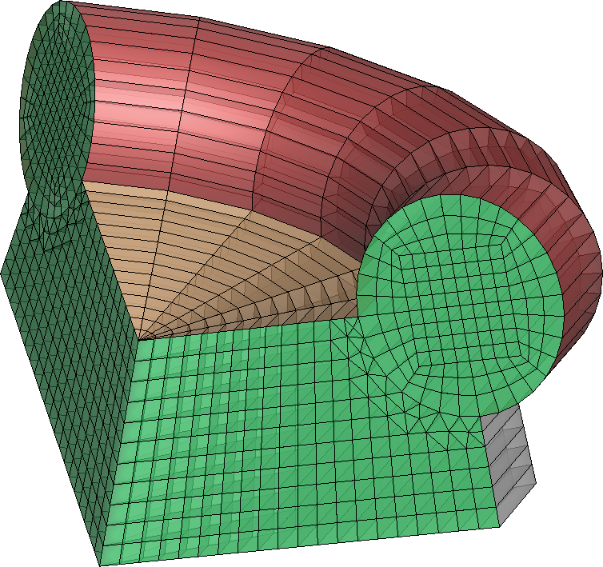

|icon| HybMesh Grid Generator
=============================

HybMesh is a general-purpose grid generator
which implements locally-structured meshing approach.
With that approach grids are assembled from prebuilt structured grid segments
by superposition operations.
Grid segments are built using provided set of grid prototypes.
HybMesh includes algebraic mapping functionality which could be applied to
map those prototypes into any given non-regular area.

Generally, locally-structured grid generation workflow includes three basic steps:

* constructing grid prototypes,
* mapping prototypes into non-regular geometry (optionally),
* assembling the resulting grid by the superposition procedure.

HybMesh could also be used to mesh arbitrary 2D and 3D domains
with fully unstructured grids. This functionality is provided
by internal calls of embedded `Gmsh <http://gmsh.info>`_ and
`TetGen <http://wias-berlin.de/software/tetgen/>`_ library routines respectively.

HybMesh application could be installed on **Windows** and **Linux** platforms.
Currently it provides a scripting interface based on Python2 language syntax.
Also a set of programming language wrappers are included in installation
distributive, so HybMesh could be utilized as an embedded meshing engine
for **C++** (11), **C#** (VisualStudio and Mono), **Matlab** (Octave compatible),
**Python** (2 and 3) and **Java** (7 or higher) applications.

Latest HybMesh distributives could be found on `releases
<https://github.com/kalininei/HybMesh/releases>`_ page.

For installation instructions and user guide, see `HybMesh documentation
<http://kalininei.github.io/HybMesh/index.html>`_.

Example Grids
=============

.. |e4| image::  doc/source/picintro_6_7.png
         :height: 300px

+----------------------------+-----------------------------+
|  .. image::  doc/source/overview_3.png                   |
|          :height: 200px                                  |
|          :align: center                                  |
|                                                          |
+----------------------------+-----------------------------+
| .. image::  doc/source/overview_2.png                    |
|          :height: 200px                                  |
|          :align: center                                  |
|                                                          |
+----------------------------+-----------------------------+
|                            |                             |
| |e3|                       | |e4|                        |
|                            |                             |
+----------------------------+-----------------------------+
