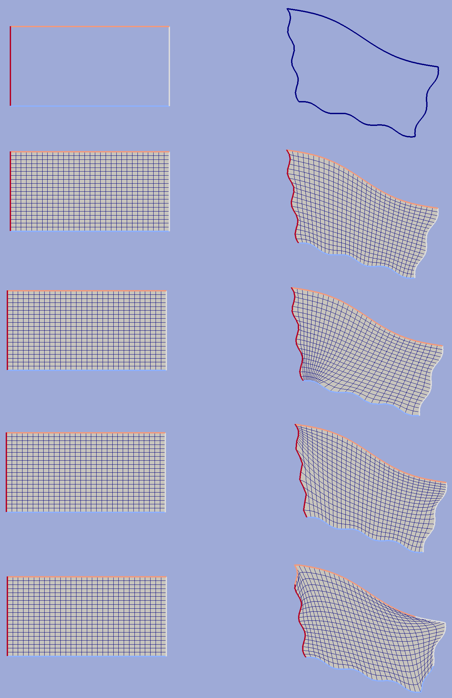
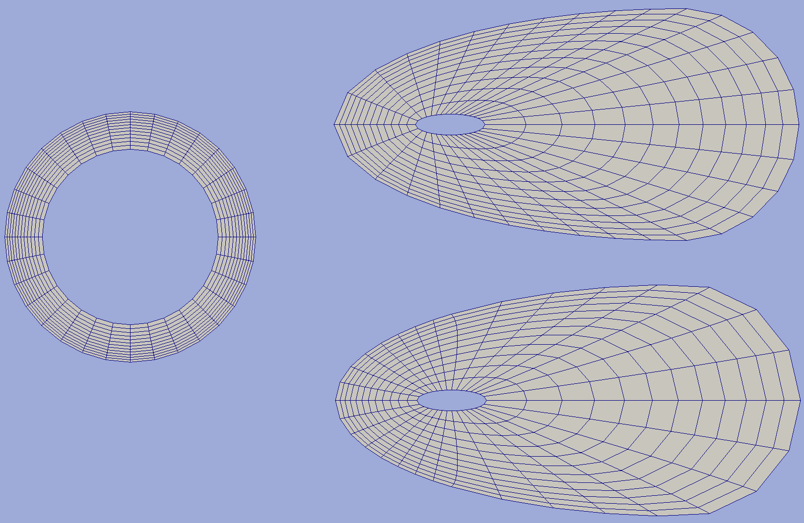
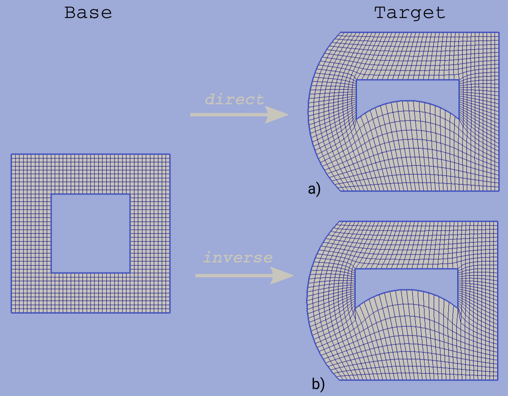
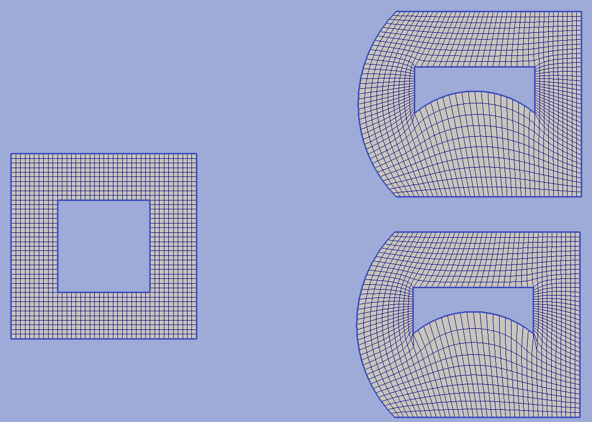

.. py:module:: hybmeshpack.hmscript

.. _functionality:

Functionality
==============

Terminology
-----------

The program operates with two geometric object types: grid and contour.
Each contour and each grid has its own unique internal name which
is used for addressing.

Contour is a set of points connected in a defined order with each contour
section bearing a boundary type feature. Contour can be open or closed or
even multiply-connected (bounding a multiply connected domain).
Their direction could not be set implicitly. In fact
all contours which bound a domain apply left direction of traversal:
all outer subcontours are traced counterclockwise and inner ones -
in the opposite.

Grid is a set of cells which are defined as a sequences of points.
Grid cell can have arbitrary number of points,
the only restriction applied to a grid cell is that it can not
be multiply connected.

.. warning::

  Not every grid format supports arbitrary cells.
  Most FEM grids (like those used in GMsh) could contain
  only triangular or quadrangular cells. This should be
  taken into account during grid exporting.

Each grid contains its own bounding contour which is
referenced as a grid contour.
It includes all boundary nodes of the grid along with grid boundary features.
Most procedures which take contour as an invariable input parameter (e.g.
set boundary types, exclude contour from a grid etc.) could also be done
using grid contours addressed by a grid internal name.

Boundary type is a non-geometric object which is defined
by integer positive boundary index (zero is the default value for non-defined
segments) and unique boundary name.
Grid exporting procedures try to use boundary names and indices
if export format supports it.

3D grid is defined by arbitrary collection of faces.
By now it is not operable object. It is only can be constructed,
exported and deleted.

.. _gridimp:

Grid Superposition
------------------
This is the basic HybMesh operation. Generally it takes two independent
grids which have non-zero domain intersection and composes them into a single grid.
The domain of resulting grid is exactly equal to the domain of geometrical union of parent grid domains and
its cells reflect the original grids cells everywhere except for a zone around the line of parent grids
contact which is triangulated providing smooth cell size transition. This zone is later referenced as a
*buffer zone*.

Order of superposition matters. For clarity sake we call the first of two original grids the *base grid*
and the second one -- *overlaid grid*. **Buffer is always built within the base grid**. Cells
of *overlaid grid* are transfered to the resulting grid mostly untouched
(except for a few boundary vertices near grids intersection zone. See :ref:`fixbnd` for details).
So, as you can see on the picture below, by swapping the grid roles we obtain different resulting grid geometry.

.. figure:: grid_imposition1.png
   :height: 600 px

   fig. 1. Basic superposition example

Hybmesh also supports superposition of grid chain. In this regime a sequence of
superposition operations are performed over a list of grids. Each operation takes the result of previous one
as a *base grid* and use the next grid in given list as an *overlaid grid*.
You should carefully define the order of grids in a input list to get desirable result.
On a picture below you can see the superposition result depending on given grids order.

.. figure:: grid_imposition2.png
   :height: 800 px

   fig. 2. Chain superposition example

Superposition with building a buffer grid only takes place if parent grid has non-zero and non single point intersection area.
Different operation results depending on relative position of input grids are presented below.

.. figure:: grid_imposition3.png
   :width: 600 px

   fig3. Superposition depending on types of given grid intersections.

If grid domains have no proper intersections (two last examples on the picture above) then the
resulting grid will contain cells from both given grids assembled to a single connectivity table.

Boundary features of superposed grid contour reflect boundary features of given grids.
If any boundary segment is contained in both *base grid* and *overlaid grid* then priority
will be given to features from the latter.

Buffer zone size
++++++++++++++++
Buffer zone is constructed as an area of all *base grid* cells which contain a vertex located
no further than given buffer zone size from contact line. Larger buffer zone provides
smoother triangle grid within the buffer (see picture below).

.. figure:: grid_imposition4.png
   :width: 600 px

   fig4. Superposition with different buffer sizes

Sometimes it is useful to superpose grids without building triangulated buffer. This could be
done by setting zero buffer zone size.
However, if vertices of *base grid* and *overlaid grid* do not coincide at contact line superposed
grid will contain hanging nodes (see second example at picture below).
The necessity of superposing grids with zero buffer could be arisen e.g. while connecting grid to
an outer boundary grid built from its own contour.

.. figure:: grid_imposition5.png
   :width: 600 px

   fig5. Superposition with zero buffer size

.. _fixbnd:

Fix boundary nodes
++++++++++++++++++

This option defines treatment of *base grid* boundary vertices if they get into buffer zone.
Sometimes building a smooth grid within the buffer demands remeshing those boundaries. However
this can lead to change of the initial domain area and loss of some boundary features. Therefore
user is given a choice whether to allow algorithm to move such vertices or not.

If *fix boundary nodes* option is set to True then all boundary vertices presented in *base grid* and
*overlaid grid* will be present in the result grid if they lie on its domain boundary.
With this option is on it is guaranteed that:

* *overlaid grid* is passed to result grid without any changes
* shape of domain intersection of input grids is precisely preserved
* boundary features of output grid exactly replicate input grid features

However there are some possible drawbacks of this option.
Picture below illustrates superposition of two square grid with complicated boundary set.
First example shows the result of operation with fixed boundary vertices.
Due to the fact that points of intersection don't hit any of the *overlaid grid*
initial vertices two hanging nodes have appeared in the result.
Furthermore since some of boundary nodes of *base grid* lied too close to
these intersection points highly skewed triangles were built in the buffer zone.

Second example on the picture below shows the same operation without *fix boundary nodes* option.
In order to get smoother grid two vertices of *overlaid grid* were moved to intersection locations and
buffer zone boundary segments were remeshed. As a result we've completely lost blue and magenta boundary
segments but the resulting grid don't contain any hanging nodes or highly skewed cells.

.. figure:: grid_imposition7.png
   :width: 700 px

   fig6. Superposition with and without fixing boundary nodes

.. _zero-angle-app:

Zero angle approximation
++++++++++++++++++++++++

By default only boundary nodes which lie on a straight line (form an angle of 180 degree) could be moved when *fix boundary nodes* option
is off. This guaranties the exact preservation of domain intersection shape.
However if grids domain is formed by smooth curved lines the option *fix boundary nodes = False* will take no effect
since all points on such lines will be treated as corner points. Option *Zero angle approximation* (:math:`\alpha_0`) allows user
to define which boundary polyline turns should be considered negligible and be treated as straight angles.
With non-zero :math:`\alpha_0` all boundary vertices which lie within buffer zone and provide
turn between :math:`[180-\alpha_0, 180+\alpha_0]` will be considered as candidates for moving or removing.

The effect of :math:`\alpha_0` option is shown in figure 7. Both results here were obtained with *fix boundary nodes = False*.
The first was done with :math:`\alpha_0=0` hence all arc points were preserved and very coarse cell size transition occurred in the
bottom of the buffer zone. In the second example arc boundary segment of the buffer zone was remeshed to get better grid quality. However
due to loss of some shape forming nodes in the latter case result domain doesn't exactly equal
input grid intersection domain.

.. figure:: grid_imposition8.png
   :width: 700 px

   fig7. Superposition without fixing boundary nodes and different
   zero angle :math:`{\alpha}_0` values

.. _emptyholes:

Empty holes
+++++++++++
If this option of grid superposition is set to true than all hulls presented at *overlaid grid* will be
preserved as hulls in the result grid. Otherwise these hulls will be filled according to
general algorithm. The effect of this option is shown at picture below.

.. figure:: grid_imposition6.png
   :width: 600 px

   fig8. Superposition with/without *Empty holes* option

.. _gridclip:

Clip Grid
---------
TODO

.. _gridmappings:

Grid Mapping
------------
This procedure maps the domain containing a grid (*base domain*) to any other domain with equal
connectivity (*target domain*) and uses this mapping to translate the grid.
Mapping is built as a result of solution of the Laplace equation with boundary conditions of
the first kind.
Boundary values are calculated using domains boundary mapping defined by user.
Boundary value problem is solved by a finite element method using
auxiliary triangular grid built within a solution domain.

There are no restrictions on the input grid and target domain except for their connectivity levels
should be equal and boundary mapping for each of bounding contours should
be provided.

Boundary features of resulting grid could be inherited either from *base* or from *target* domain
depending on user defined option.

Boundary Mapping Definition
+++++++++++++++++++++++++++

Boundary mapping is defined by a collection of reference point pairs :math:`(p_i, p'_i)` where
:math:`p_i` are points located on the *base domain* contour and :math:`p'_i` are points
from the *target domain* contour.
Any physical *base domain* point that equals
one of the defined :math:`p_i` will be mapped exactly to corresponding :math:`p'_i`,
otherwise linear interpolation between adjacent defined points will be made.

   fig.1. Grid mapping with different boundary mapping options

To obtain contour mapping user should define at least one reference point on it.
However to provide a good final result all characteristic contour points should be reflected
in the reference points collection.

Example of mapping of the uniform rectangle grid into a curvilinear
quadrangle is depicted in fig.1. If all four characteristic points are used for boundary mapping definition
(fig.1a) then all base contour corner points map into target contour corners and
all lateral sides of target contour have uniform partition (as it was in the base contour).

To obtain target boundary coarsening and refinement it is possible to define some additional
reference points on the laterals (fig.1b, fig.1c). However all such changes of boundary mapping
affect the area near the boundaries only. To get smooth internal grid with refinement towards
one of the edges base domain grid should be changed accordingly.

If not all corner points are defined in reference point set then this could lead to situations
when a corner point is mapped into a lateral segment. 
If this happens resulting grid would have poor quality (fig.1d).

   fig.2. Mapping of doubly connected domain

In the figure above the example of mapping of a grid in the doubly connected domain is shown.
Since base grid has no corner points acceptable result could be obtained using single
reference point for each bounding contour (fig.2a), however definition of additional points in order 
to adopt boundary points distribution increases grid quality (fig.2b).

The order of points in reference points set doesn't matter. However this set should
be valid, i.e.:

* if points :math:`p_1, p_2` are located on the same base contour,
  then corresponding points :math:`p'_1, p'_2` should be located on
  the same target contour;
* if base contour points :math:`p_1, p_2` are located on the
  same base contour and point :math:`p_3` lies between them
  then point :math:`p'_3` should lie between corresponding
  points :math:`p'_1, p'_2` on the target contour.

.. _laplace_map_algo:

Algorithms
++++++++++

.. figure:: map_grid3.png
   :width: 500 px

   fig.3. Domain mapping

Let :math:`\Omega` and :math:`\Omega'` denote base and target domains
which are defined in two dimensional spaces :math:`(x,y)` and :math:`(\xi, \eta)` respectively (see fig.3).
To map a grid defined in :math:`\Omega` into the domain :math:`\Omega'` we have to build
continuous coordinate system transformation: :math:`(x,y)\to(\xi, \eta)` and apply it to all
grid vertices.

Hybmesh provides two methods of building such transformation. Both are based on a solution
of the Laplace equations system supplemented by boundary conditions of the first kind.
Problem formulation for the first one (later referenced as the *direct Laplace algorithm*) is 
given in terms of functions :math:`\xi(x, y)`, :math:`\eta(x, y)` defined in the *base domain*:

.. math::
  :label: direct_laplace

  \begin{cases}
    -{\nabla^2}_{xy}\,\xi = 0, \\
    -{\nabla^2}_{xy}\,\eta = 0,
  \end{cases}
  \text{for } (x, y) \in \Omega;

  \begin{cases}
    \xi = \xi_b(x, y),\\
    \eta = \eta_b(x, y),
  \end{cases}
  \text{for } (x, y) \in \gamma,

where :math:`\xi_b`, :math:`\eta_b` are known boundary mapping functions. After the solution of 
:eq:`direct_laplace` is obtained further grid mapping is straightforward.

Second algorithm (later referenced as the *inverse Laplace algorithm*) is based on a formulation in terms of functions :math:`x(\xi, \eta)`,
:math:`y(\xi, \eta)` defined in the *target domain*:

.. math::
  :label: inverse_laplace

  \begin{cases}
    -{\nabla^2}_{\xi\eta}\,x = 0, \\
    -{\nabla^2}_{\xi\eta}\,y = 0,
  \end{cases}
  \text{for } (\xi, \eta) \in \Omega';

  \begin{cases}
    x = x_b(\xi, \eta),\\
    y = y_b(\xi, \eta),
  \end{cases}
  \text{for } (\xi, \eta) \in \gamma',

where :math:`x_b`, :math:`y_b` are known boundary mapping functions.
Functions :math:`\xi(x, y)`, :math:`\eta(x, y)` which are required for grid mapping
are obtained by inverting the functions :math:`x(\xi, \eta)`, :math:`y(\xi, \eta)` gained
as a solution of the system :eq:`inverse_laplace`.

**These algorithms are not generic.** To build a single valued transformation, functions
obtained as the solution of governing systems :eq:`direct_laplace` or :eq:`inverse_laplace`
should not contain local extrema and saddle points in the inner domain. The first property is provided by
the choice of governing equations however saddle points may occur for certain boundary
conditions. It is only guaranteed that

* transformation obtained by the *direct Laplace* algorithm is correct if
  *target domain* is convex;
* transformation obtained by the *inverse Laplace* algorithm is correct if
  *base domain* is convex.

Violation of the above conditions doesn't inevitably lead to incorrect mappings.
Ambiguous transformations occur only near the "sharply concave" domain edges.
Furthermore, even if such transformation was obtained but all grid points stay
outside ambiguous zones, then the result will still be fine.

   fig.4. Mapping to and from a concave domain

For example let us consider mapping of the uniform rectangle grid
into a domain with M-shaped top side (see fig.4).
Since the *base domain* is convex we can securely do it using the *inverse Laplace* method (fig.4b);
the *direct Laplace* algorithm gives improper mapping and self-intersected grid as it is
shown in fig.4a.
If we swap the roles of *base* and *target* domains, i.e. try to map
M-shaped grid into a rectangle, then, on the contrary, only the *direct Laplace algorithm*
will provide a single-valued transformation (fig.4c). The *inverse* method gives improper
mapping, i.e. some points of the *target domain* are mapped outside the *base domain*,
however, as soon as all inner base grid points have single-valued images at *target domain*,
the program is able to assemble valid, although not qualitative grid (fig.4d). 

The proper method for grid mapping depends on a shape of input domains.
Since in practical applications *base domains* are often chosen to be smooth and regular
then the *inverse Laplace* algorithm seems to be more robust, however in some cases the *direct method*
provides better mapping near the boundaries (see examples in fig.4c, fig.5).

   fig.5. Comparison of *direct* and *inverse* algorithms applied to
   a doubly connected domain

Snapping
++++++++

The domain of a grid obtained by mapping procedure will not exactly equal the target domain
until boundary mapping for each valuable  *target domain* vertex is explicitly defined (see fig.6a).
However the program can evolute a special postprocessing procedure which modifies
resulting boundary vertices with respect to original *target contour*.

.. figure:: map_grid6.png
   :width: 400 px

   fig.6. Grid map with snapping. Magenta markers denote *target domain* vertices.

With the snapping option *"Shift vertices"* all boundary vertices of resulting grid will be
shifted to closest valuable *target* vertex (see fig.6b). Option *"Add vertices"* forces
all boundary edges be extended by *target* vertices which lie between edge end points ( see fig.6c).
The latter guarantees that the resulting domain will be equal to the original *target domain*, however
it changes grid topology so that it won't be the same as the topology of the *base grid*.

Snapping for each boundary edge will only take place if it is valid, i.e. it
will not result in intersections with internal grid edges.

Python interface function: :func:`map_grid`.
See also: :ref:`custom_rect_grid`, :ref:`circrect_grid`.

Contour Operations
------------------
TODO

3D Grid Building
----------------
TODO
