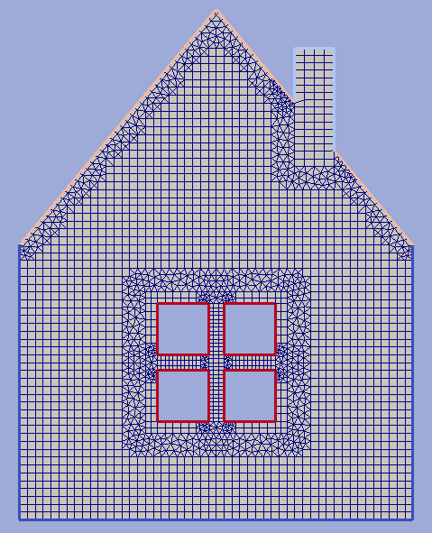

.. _example2:

Example 2
=========

Here we mesh a house-like domain keeping separate boundary features
for edges which lie on the roof, window spans and the tube.

   fig1. Resulting grid

.. literalinclude:: ../../testing/py/fromdoc/intro_house.py
   :end-before: ^^^^^^^^^^^^^^^
