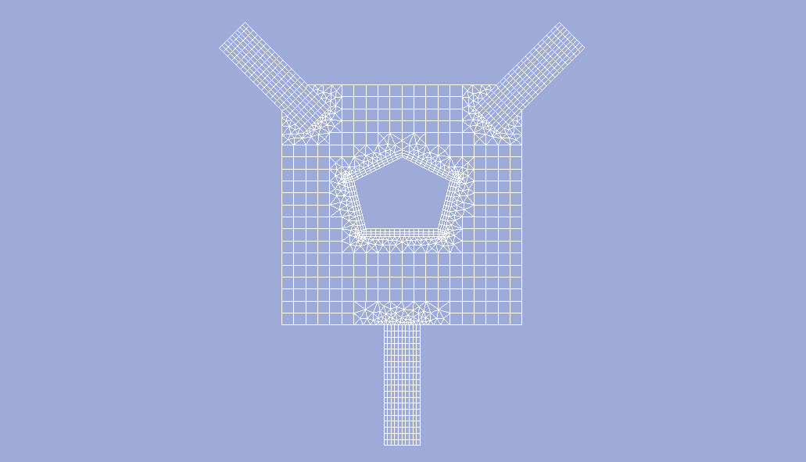

.. _example3:

Example 3
=========

Building a grid around a half-cylinder with a cut placed on the bottom of the channel.

   fig1. Resulting grid

.. literalinclude:: ../../testing/py/fromdoc/intro_hcyl.py
   :end-before: ^^^^^^^^^^^^^^^
