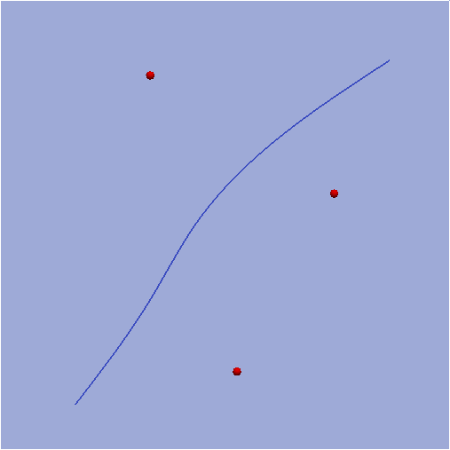
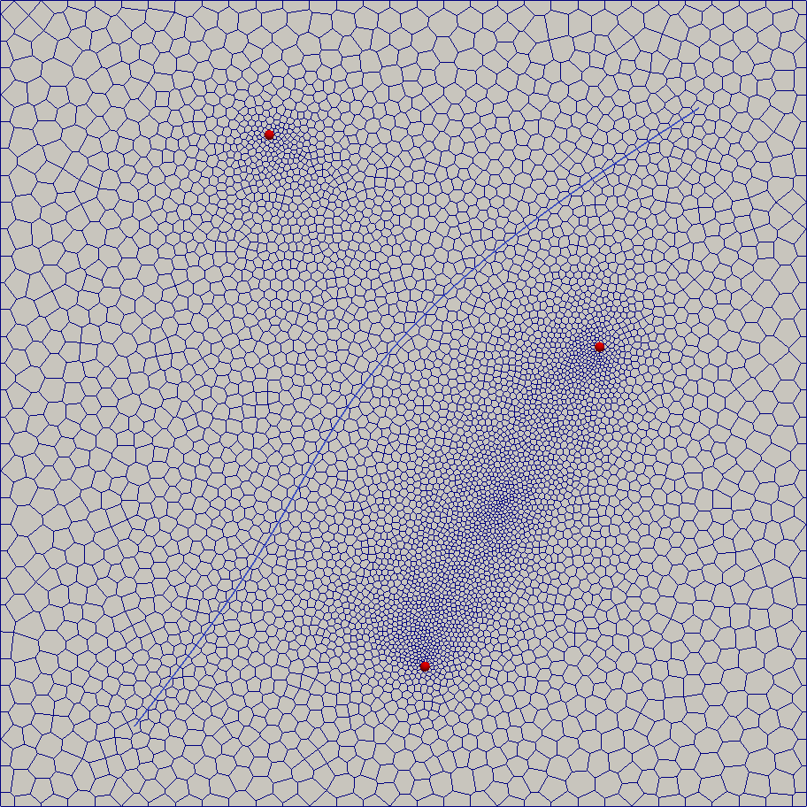
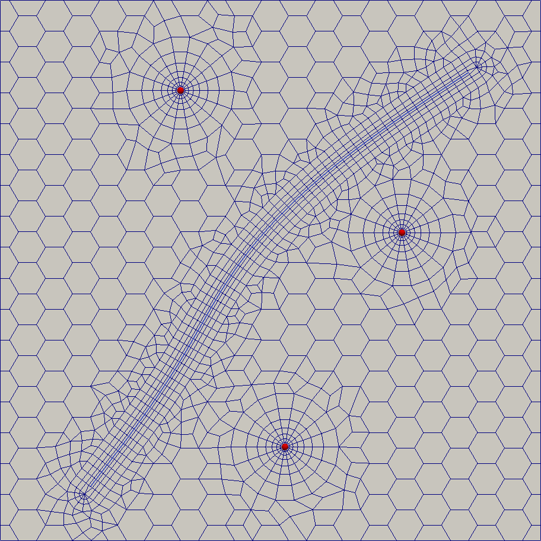
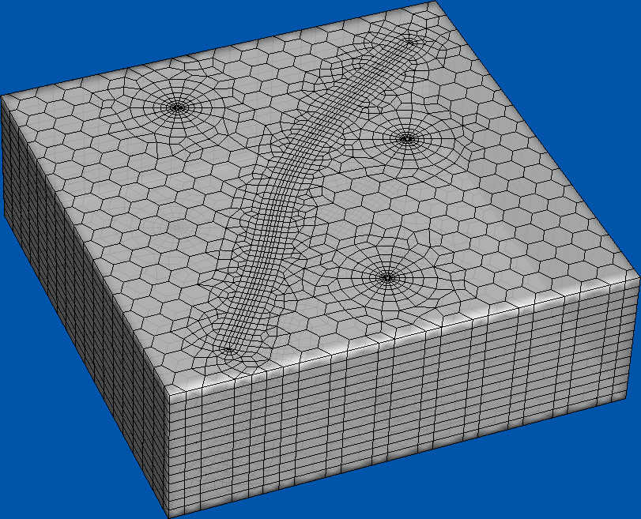

.. _example6:

Example 6
=========

In the present example a grid for a typical oil reservoir simulation problem will be built.
The modeling area is a square which contains three well sites and a fracture contour (or horizontal well contour) (see fig. 1 below).
Flow patterns of such problems provide very large fluid velocity gradients near wells and fractures hence it
is a common practice to build grids with substantial refinement towards well and fracture locations.

Required grid depends on a numerical method. First lets assume we build a grid which
will be used in a linear finite element solver. Hence we need a grid which contains
only triangle/quadrangle cells, well locations are its vertices and fracture contour segments
coincide with its edges.

   fig. 1

The simplest straightforward approach is to use unstructured conditional triangulation.
Hybmesh script for that algorithm contains three lines (operations):

* fracture contour partition;
* domain contour partition;
* conditional domain triangulation.

.. figure:: picintro_6_2.png
   :width: 400 px
   :figclass: align-center

   fig. 2

The resulting grid (depicted in fig. 2) has at least two evident flaws. First the refinement from the upper well towards
the upper domain segment is very coarse. It happened because we have explicitly defined partition of domain boundary without
taking well locations into account. Another problem is that the region between two lower wells is meshed too fine because
even far away from their sites these wells remain the closest cell size detection sources.

To overcome those flaws we will use conditional 1D partition of domain boundary and place a supplementary
cell size condition between two lower wells. Furthermore we will use recombine algorithm to
turn our triangle mesh to a mesh containing mostly quadrangle cells. The result is shown in figure 3.

.. figure:: picintro_6_3.png
   :width: 400 px
   :figclass: align-center

   fig. 3

Despite we've defined mesh refinement in the regions of high fluid flow velocities the numerical solution
could still be imperfect because of usage of unstructured grids near well bores. We can increase
solution accuracy by building a radial grids around wells which are known to provide better solution for radial symmetric flows
thus using locally structured approach to grid generation.
So we build three radial grid prototypes to treat well zones, stripe grid prototype in a fracture zone
and impose them onto a regular quadrangle substrate grid. Result is shown in figure 4.

.. figure:: picintro_6_4.png
   :width: 400 px
   :figclass: align-center

   fig. 4

Now we'll illustrate usage of Hybmesh for finite volume grid generation.
Such grids can contain arbitrary cells (regular hexagonal cells are preferred).
Well sites should lie in the centers of cells. Location of fracture contour
depends on numerical algorithm. We will place it to the cell centers too (as it would
be if this is a horizontal well contour).

As before we can use simple straightforward approach by
execution of conditional unstructured griding routine with
perpendicular bisector cells (figure 5) or apply locally structured approach (figure 6).
We also can utilize any of those 2D grids to build 3D ones using simple extrusion algorithm (figure 7).

   fig. 5

   fig. 6

   fig. 7

-------------------------------------

.. literalinclude:: ../../testing/py/fromdoc/intro_filtration.py
   :end-before: ^^^^^^^^^^^^^^^
