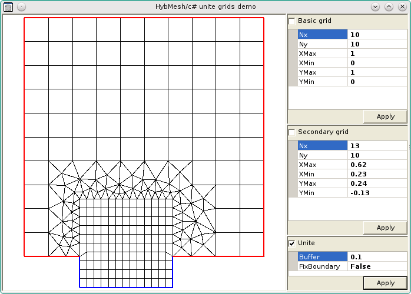

Usage
^^^^^

C# wrapper includes *Hybmesh.cs* source file and *core_hmconnection_cs*
library. Copy source file to your application directory and
add it into your project in order to use it.

Assign static properties

.. code-block:: C#

  Hybmesh.hybmesh_exec_path = "directory/containing/hybmesh";
  Hybmesh.hybmesh_lib_path = "directory/containing/core_hmconnection_cs";

prior to first **Hybmesh** instance creation to define
custom paths if they differ from default ones.

Besides basic geometrical and exception classes
Hybmesh superclass also provides 2 additional nested classes defining 2D
and 3D Point which are used to pass point arguments to hybmesh methods.

**Hybmesh** superclass implements *IDisposable* interface and
could be used within C# using statement

.. code-block:: c#

    using (var hm = new Hybmesh()){
        //...
    }

This will close background hybmesh application immediately when
the block ends. Otherwise it will wait for garbage collector.

C# accepts only compile time constants as default function arguments.
As a result it is impossible to add default arrays (even empty arrays) to
function signatures. In those cases Hybmesh C# wrapper uses
*null* values which are treated as predefined defaults.
Arguments which provide *null* default values are listed in
respective function xml docs.

This is an example of a function
signature with default *null* as it appears in *Hybmesh.cs* file:

.. code-block:: C#

     /// 

     /// Creates singly connected contour as a parametric cubic spline.
     /// See details in hybmeshpack.hmscript.create_spline_contour().
     /// 

     /// <param name="bnds">if null then int[] {0}</param>
     public Contour2D CreateSplineContour(Point2[] points, int[] bnds=null, int nedges=100){
         bnds = bnds ?? new int[] {0};
         //....
     }

Here if **bnds** argument is given as *null* it will be reassigned to ``int[] {0}`` array.

For detailed description of all methods consult
:ref:`python wrapper reference<ooipython>`
and embedded documentation of wrapper ``Hybmesh.cs`` source file.

.. _csintro:

Introductory Example
^^^^^^^^^^^^^^^^^^^^

The present example Winforms application builds
two regular rectangular grids and performs their
:ref:`superposition<gridimp>` with user defined parameters.
Callback with cancellation support popup dialog
is used for grid union operation.

To run it under Mono create a directory
containing *app.cs* file listed below along
with *Hybmesh.cs* wrapper file. Then
execute following commands

.. code-block:: bash

     mcs app.cs Hybmesh.cs -r:System.Windows.Forms.dll -r:System.Drawing.dll
     mono app.exe

Do not forget to adjust or remove *App.main()* lines 
defining custom paths to hybmesh executable
and *core_hmconnection_cs* library.

Hybmesh function call with progress bar dialog
is provided by *AppGui.ProgressBarExecutor.Exec()* static method.

.. Warning::

  For illustration and testing purposes callback function of current
  application is intentionally delayed by
  *AppGui.ProgressBarExecutor.CBForm.Callback()*
  function. This delay could be safely removed.

.. literalinclude:: ../../testing/bindings/cs/fromdoc/app.cs
  :language: c#
  :tab-width: 4
  :caption: app.cs
