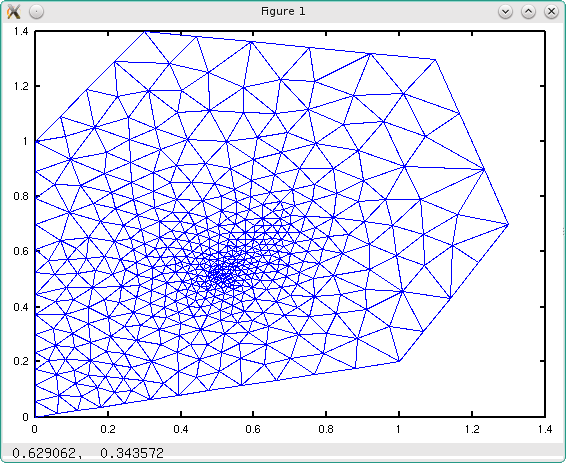

Matlab Bindings for HybMesh
===========================

Usage
^^^^^

Matlab (Octave) bindings contain set of source \*.m files
(one for each class) and a pair of shared libraries ``core_hmconnection_oct.oct``,
``core_hmconnection_matlab`` for Octave and Matlab communication respectively.
The most convenient way to deal with all that mess is to use ``addpath`` directive
to include the whole bindings directory. After that the **Hybmesh** class
will be available. To set directory containing hybmesh executable (if it differs
from the default) use static **Hybmesh.hybmesh_exec_path()** method.

Like Python interface, matlab wrapper doesn't provide
special point classes. Instead a raw vector with 2 or 3 entries
should be used to pass a point to a function.
When point list of size ``n`` is needed use ``nx2`` or ``nx3`` matrix.
When list of geometrical objects is needed use cell arrays.
In the following example two contours are created by passing
a list of points and then
they are connected by a method taking cell array of contour objects
as argument:

.. code-block:: matlab

    hm = Hybmesh();
    c25 = hm.create_contour([0, 0; 1, 0; 2, 0]);
    c26 = hm.create_contour([2, 0.1; 3, 0.1; 4, 1]);
    c27 = hm.connect_subcontours({c25, c26}, []);

``nan`` value is used instead of Python ``None`` where not-defined
object should be passed.

As it was mentioned above there are no special
exception classes in Matlab bindings (since they are not supported by Octave).
Instead simple **error()** calls are used which could also be
handled in ``try...catch...end`` blocks.

.. Warning::
  
   Native Matlab indexing starts from one. However
   Hybmesh operates with zero based indices. So
   all hybmesh wrapper functions which require
   indices as arguments or return
   set of indices of any kind use C-style indexing.

Some wrapper functions ending arguments could be omitted
in order to use their default values. Such arguments along with
their default values are specified in function documentation.
For example this is *Hybmesh* method for building rectangular
grid as it is defined in ``Hybmesh.m`` wrapper file

.. code-block:: matlab

        function ret=add_unf_rect_grid(self, p0, p1, nx, ny, bnd)
        % ADD_UNF_RECT_GRID
        % Builds rectangular grid.
        %   p0: 2d point as [x, y];
        %   p1: 2d point as [x, y];
        %   nx: int;
        %   ny: int;
        %   bnd: row vector of int. DEFAULT is [0, 0, 0, 0];
        %   ----
        %   returns: GRID2D;
        % 
        % See details in hybmeshpack.hmscript.add_unf_rect_grid().
            if (nargin < 6)
                bnd = [0, 0, 0, 0];
            end
            ....

Here the first argument is used to address *Hybmesh* instance.
The function by itself takes 5 parameters, but also could be
called with only 4. In the latter case default *bnd = [0, 0, 0, 0]*
will be used.

*Hybmesh* is a handle class which has a destructor *delete* method.
Until this method is called hybmesh background executable will not stop working.
Matlab calls it implicitly when an instance of *Hybmesh* gets out of context.
However if this instance presents in the global scope, it is recommended to
destroy it manually either by invocation of *delete* method or using ``clear``
directive.

For detailed description of all methods consult
the :ref:`Python binding functions reference<ooifuncref>`
and embedded documentation of wrapper ``*.m`` files.

Helloworld Example
^^^^^^^^^^^^^^^^^^

After successful hybmesh installation create the following file
replacing path at the first line if needed and run
it as a usual Matlab/Octave script

.. code-block:: matlab
     :caption: hmtest.m

     addpath('C:/Program Files/Hybmesh/include/m');
     
     hm = Hybmesh();
     g = hm.add_unf_rect_grid([0, 0], [1, 1], 2, 2);
     d = g.dims();
     fprintf('number of cells: %i\n', d(3));
     clear hm;

Introductory Example
^^^^^^^^^^^^^^^^^^^^

In this example a simple unstructured triangle grid
in custom polygon is built and displayed.
Grid step sizes are defined by reference point boundary partition
and two embedded point conditions.
The unstructured triangulation is performed by
internal call of corresponding GMSH method.

.. literalinclude:: ../code_preproc_out-unstruct_tri.m
    :language: matlab
    :tab-width: 4
