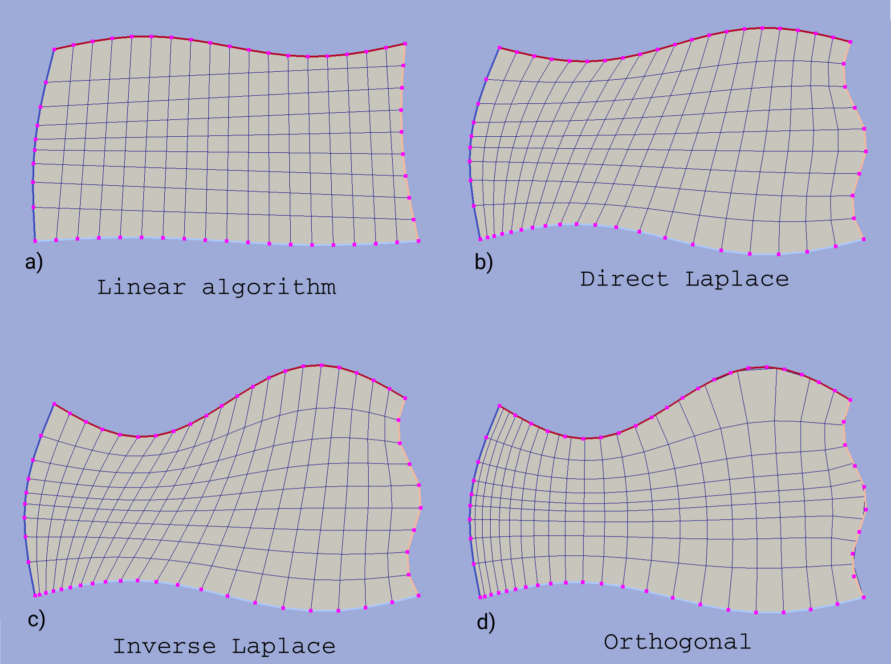

.. _prototypes:

.. py:module:: hybmeshpack.hmscript

Grid Prototypes
===============

Rectangle Grid
--------------

Radial Grid
-----------

Ring Grid
---------

Triangle Grid
-------------

.. _circrect_grid:

Square in Circle 
----------------
This creates a quadrangular cell grid in a circular area in such a way that
the resulting grid contains uniform square grid in the center of defined
area which is extended by a ring-like grid towards the outer circular boundary as
it is shown in the figure below.

.. figure:: proto_circrect.png
   :width: 600 px

   Square in circle grids built with different options

Geometry of the circular area is defined by the center point and radius.
Partition is calculated using the approximate size of outer boundary step
passed by user. Since the grid in the ring part of the area is built in a
:math:`\pi/4` sector, resulting number of steps along outer boundary will be divisible
by 8.

Size of the inner square is defined by a parameter *a* equals the ratio
of circle radius to square side length. Its default value is unity and, apparently, it can not be greater than :math:`\sqrt2`.

Additionally user can define refinement coefficient for the ring grid in a radius direction.
This coefficient approximately equals the ratio of the first 
step in a radial direction at :math:`\pi/4` to the outer boundary step. Values less than
unity lead to a refinement towards the outer boundary.

Four algorithms of building ring part of the grid are implemented:

* **Linear algorithm**. Radial lines are created by linear connection of corresponding points on outer an inner segments.
  Then these lines are divided keeping constant reference weights of each step.
* **Laplace algorithm**. An algebraic mapping from a uniform square grid to the sector area is built in such a way
  that each boundary sector vertex be mapped to a uniform square boundary vertex. 
* **Orthogonal with uniform rectangle grid**. An orthogonal mapping from a rectangle to the sector area is built.
  Arc grid lines are built starting from the predefined vertices of the shortest radius line.
  Radial grid lines start from the predefined square sides vertices.
* **Orthogonal with uniform circular grid**. The same as the previous but radial lines start
  from outer circle vertices.

The first, second and third algorithms give uniform grid within inner square;
the first, second and forth - uniform outer circle partition.
Only last two algorithms build an orthogonal grid.

Python interface function: :func:`add_circ_rect_grid`.

.. _custom_rect_grid:

Custom Rectangle Grid
---------------------
Builds a structured quadrangle grid within an area bounded by four curvilinear sides.

For the sake of clarity let us denote four basic contours as *left*, *bottom*, *right*, and *top*.
This nomenclature is conventional, it doesn't reflect real geometrical position but only the fact that horizontal grid lines
will connect vertices from *left* and *right* contour and vertical lines - vertices from *bottom* and
*top* contours. Boundary vertices of resulting grid will equal input contour vertices, hence
number of cells in resulting grid is defined by the partition of passed contour. 

There is no need to exactly connect contours before passing 'em to grid constructor.
The direction of passed contours also doesn't matter. The program will try to translate
and stretch contours to build a closed domain with minimum translation distance possible. The order of input
contour transformations is:

1) place the *left* contour as it is;
2) connect the *bottom* contour with the *left* contour bottom point;
3) connect the *top* contour with the *left* contour top point;
4) connect the *right* contour with the *bottom* contour right point;
5) stretch the *right* contour so its upper point fits *top* contour right point.

As a result of these modifications

* for the contour passed as *left* both position and shape are preserved,
* for the *top* and *bottom* contours shape is preserved,
* for the *right* both position and shape could be changed.

The definition of *right* and/or *top* contours could be omitted. If so then the *right*/*top* contour will be built
by parallel translation of the *left*/*bottom* one. The resulting domains built by different input contours are shown
in figure below.

.. figure:: proto_custom_rect1.png
   :width: 600 px

   Assembling closed domain based on not connected base contours

Boundary features of resulting grid are inherited from the boundary features of input contours.

Four algorithms of building internal grid nodes are implemented. Examples of grids built
using different algorithms is shown in figure below.

   Custom rectangular grids built using different algorithms.
   Passed contours vertices are shown by magenta marks.

**Linear algorithm**. Corresponding vertices from opposite contours are connected by
straight lines and grid cells are built on intersection points. This is
the fastest algorithm although it doesn't provide smoothing near the curvilinear 
edges, hence it should be used only if input contours are straight lines.

**Direct/Inverse Laplace algorithm**. An algebraic mapping from
unit square to input domain is built using the *direct* or *inverse laplace* algorithm.
To build a grid line (horizontal or vertical) first its start points are defined
in physical domain, then these points are translated into unit domain where they
are connected by a straight line which is finally mapped back to the physical domain. 
Explanation of algebraic mapping building, difference between *direct* and *inverse*
algorithms and their limitations can be found in :ref:`laplace_map_algo`.
Since unit square is used as a *base domain* then the *inverse* algorithm always gives
valid results whereas the *direct* may fail due to grid self-intersections.

**Orthogonal algorithm**. This method builds an orthogonal mapping from
input domain to the unit square based on a solution of Laplace equation with mixed boundary conditions.
To build a vertical line first
a start point in physical area is defined by a vertex of the *bottom* contour.
Then this point is translated into the unit domain from which a strictly vertical
line is built and mapped back into the physical area. Horizontal grid lines
built in the similar way starting from vertices of the *left* contour.
The resulting grid is guaranteed to be orthogonal disregarding the grid edges straightening.

Linear and Laplace algorithms demand equal partition of opposite contours.
Orthogonal algorithm completely ignores partition of *right* and *top* contours.

Python interface function: :func:`add_custom_rect_grid`.

.. _bgrids:

Boundary Grids
--------------
TODO
